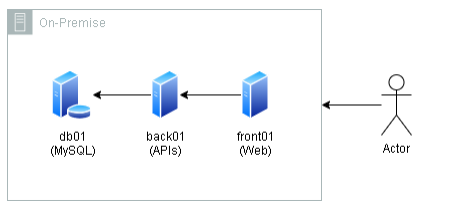

<h3 align="center">< Projeto Cloud /></h3>

<h1 align="center">
     Compass UOL - DevSecOps
</h1>

Projeto Cloud da trilha de **DevSecOps**, dividido em duas partes:

1. Migração para AWS:
2. Modernização:

## Contexto

A empresa **"Fast Engineering S/A"** gostaría de uma solução desenvolvida pela empresa terceira **"TI SOLUÇÕES INCRÍVEIS"**.

**Problema**: O e-commerce está crescendo e a solução atual não está atendendo a alta demanda de acessos e compras.

Atualmente é utilizado:

- **Banco de Dados**: MySQL (500GB de dados, 10GB de RAM, 3 Core CPU)
- **Frontend**: React (5GB de dados, 2GB de RAM, 1 Core CPU)
- **Backend**:
  - 3 APIs
  - Nginx como balanceador de carga
  - Armazena arquivos estáticos (5GB de dados, 4GB de RAM, 2 Core CP)

Diagrama da situação atual:

## Obejtivo Final

- Migração bem sucedida para AWS;
- Ambiente modernizado com Kubernetes;
- Banco de dados gerenciado (PaaS e Multi-AZ);
- Backup de dados;
- Sistema para persistência de objetos (imagens, vídeos etc.);
- Requisitos de segurança avançados;

## Migração

A migração será feita a partir do modo Lift-and-Shift (Rehosting), onde, toda a infraestrutura local será transferida para a núvem sem grandes mudanças nos sistemas e aplicações.

Source: [nasscom.in](https://community.nasscom.in/communities/application/lift-and-shift-cloud-migration-application-modernization-comprehensive)

## Etapas

A migração vai ocorrer em diferentes etapas:

1. Planejamento
2. Preparação
3. Migração
   - Banco de Dados
   - Arquivos
   - Aplicação
4. Observação
5. Observação

### Planejamento

Definição das instâncias que serão utilizas na AWS:

- **Frontend**: Instâncias EC2 (tipo **t4g.micro** / vCPU: 2, Memória: 1 GB).
- **Backend**: Instâncias EC2 (tipo **t4g.medium** / vCPU: 2, Memória: 4 GB).
- **Banco de Dados**: Amazon RDS MySQL (tipo **db.m5.xlarge** / vCPU: 2, Memória: 16 GB).

> De início, os arquivos estáticos vão ser salvos no EBS

Análise e comparação dos serviços utilizando na empresa com as oferencidas pela AWS:

|                                                       -                                                        | Serviço       | On premise                  |
| :------------------------------------------------------------------------------------------------------------: | ------------- | --------------------------- |
|                                         | EC2           | Servidor 1 (Frontend)       |
|                                        | RDS (MySQL)   | Servidor 2 (Banco de Dados) |
|  | Load Balancer | Servidor 3 (Nginx)          |

Serviços extras:

|                                                       -                                                       | Serviços                                                     |
| :-----------------------------------------------------------------------------------------------------------: | ------------------------------------------------------------ |
|   | IAM                                                          |
|                        | EBS                                                          |
|  | VPC   + Subnets, Route Table e Security Groups |
|                   | CloudWatch                                                   |

Serviços que serão utilizados durante a migração:

|                                                      -                                                       | Serviço                             |
| :----------------------------------------------------------------------------------------------------------: | ----------------------------------- |
|                                    | AWS Backup                          |
|            | VPN/VPN Connection                  |
|               | Database Migration Service (DMS)    |
|  | Application Migration Service (MGN) |

Diagrama de Migração:

### Preparação

É durante a etapa de preparação que iremos configurar todas os nossos serviços para iniciar a migração dos dados e aplicações para a **AWS**:

| Serviço                                         | Configuração                                                                                             |
| ----------------------------------------------- | -------------------------------------------------------------------------------------------------------- |
| **IAM (Identity and Access Management)**        | Configuração do controle de acesso com políticas de menor privilégio e autenticação multifatorial (MFA). |
| **VPC, Subnets, Route Tables, Security Groups** | Configuração das regras de acesso e saída para maior segurança.                                          |
| **VPN/VPN Connection**                          | Configuração de VPN para conexão segura entre rede on premise e a AWS.                                   |
| **AWS Backup**                                  | Configuração de políticas de backup automatizado para bancos de dados, volumes EBS e instâncias EC2.     |
| **Amazon CloudWatch**                           | Configuração do monitoramento de logs, métricas e alarmes e segurança dos serviços.                      |
| **DMS (Database Migration Service)**            | Configuração para a migração do banco de dados.                                                          |
| **MGN (Application Migration Service)**         | Configuração para a replicação dos servidores.                                                           |

### Migração

| **Serviço/Etapa**                        | **Configuração/Descrição**                                                                                                 |
| ---------------------------------------- | -------------------------------------------------------------------------------------------------------------------------- |
| **Instalação do AWS MGN Agent**          | Instalação do **Agente AWS MGN (Application Migration Service)** nos servidores locais para replicação.                    |
| **AWS DMS (Database Migration Service)** | Utilização do **AWS DMS (Database Migration Service)** para migração do banco de dados MySQL do ambiente local para a AWS. |

## Modernização

## Referências

- https://docs.aws.amazon.com/mgn/
- https://docs.aws.amazon.com/dms/
- https://www.youtube.com/watch?v=8CABO6FdzwU&ab_channel=AmazonWebServices
- https://www.youtube.com/watch?v=bJCmZn9fASM&ab_channel=DigitalCloudTraining

> Apagar depois

## Migração

- MGN
- DMS
- S3
- EC2
- RDS
- EBS

## Serviços

- Application Migration Service
- Database Migration Service
- DataSync
- S3
- EC2
- RDS
- Elastic Block Store
- Load Balance
- NAT Gateway
- Internet Gateway
- WAF
- Route 53
- CloudFront
- CloudWatch
