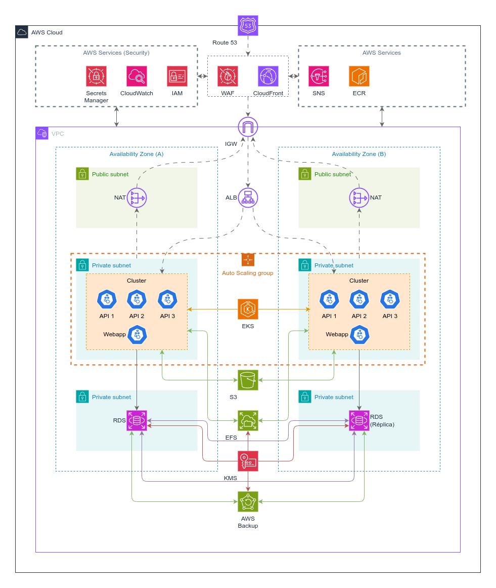

<h3 align="center">< Projeto Cloud /></h3>

<h1 align="center">
     Compass UOL - DevSecOps
</h1>

👥 Integrantes do Grupo:
- Lucas Pinheiro Josino da Silva
- Fabiano Vandré Campelo de Medeiros

Projeto Cloud da trilha de **DevSecOps**, dividido em duas partes:

1. Migração para AWS:
2. Modernização:

## Contexto

A empresa **"Fast Engineering S/A"** gostaría de uma solução desenvolvida pela empresa terceira **"TI SOLUÇÕES INCRÍVEIS"**.

**Problema**: O e-commerce está crescendo e a solução atual não está atendendo a alta demanda de acessos e compras.

Atualmente é utilizado:

- **Banco de Dados**: MySQL (500GB de dados, 10GB de RAM, 3 Core CPU)
- **Frontend**: React (5GB de dados, 2GB de RAM, 1 Core CPU)
- **Backend**:
  - 3 APIs
  - Nginx como balanceador de carga
  - Armazena arquivos estáticos (5GB de dados, 4GB de RAM, 2 Core CP)

Diagrama da situação atual:

## Obejtivo Final

- Migração bem sucedida para AWS;
- Ambiente modernizado com Kubernetes;
- Banco de dados gerenciado (PaaS e Multi-AZ);
- Backup de dados;
- Sistema para persistência de objetos (imagens, vídeos etc.);
- Requisitos de segurança avançados;

## Migração

A migração será feita a partir do modo Lift-and-Shift (Rehosting), onde, toda a infraestrutura local será transferida para a núvem sem grandes mudanças nos sistemas e aplicações.

Source: [nasscom.in](https://community.nasscom.in/communities/application/lift-and-shift-cloud-migration-application-modernization-comprehensive)

## Etapas

A migração vai ocorrer em diferentes etapas:

1. Planejamento
2. Preparação
3. Migração
   - Banco de Dados
   - Arquivos
   - Aplicação

### Planejamento

Definição das instâncias que serão utilizas na AWS:

- **Frontend**: Instâncias EC2 (tipo **t4g.small** / vCPU: 2, Memória: 2 GB).
- **Backend**: Instâncias EC2 (tipo **t4g.medium** / vCPU: 2, Memória: 4 GB).
- **Banco de Dados**: Amazon RDS MySQL (tipo **db.m5.xlarge** / vCPU: 2, Memória: 16 GB).

> De início, os arquivos estáticos vão ser salvos no EBS

Análise e comparação dos serviços utilizando na empresa com as oferencidas pela AWS:

|                                                       -                                                        | Serviço       | On premise                  |
| :------------------------------------------------------------------------------------------------------------: | ------------- | --------------------------- |
|                                         | EC2           | Servidor 1 (Frontend)       |
|                                        | RDS (MySQL)   | Servidor 2 (Banco de Dados) |
|  | Load Balancer | Servidor 3 (API's + Nginx)  |

#### Serviços extras:

|                                                       -                                                       | Serviços                                                     |
| :-----------------------------------------------------------------------------------------------------------: | ------------------------------------------------------------ |
|   | IAM                                                          |
|                        | EBS   (Utilizado pelo AMS/MGN)                 |
|  | VPC   + Subnets, Route Table e Security Groups |

#### Serviços que serão utilizados durante a migração:

|                                                      -                                                       | Serviço                             |
| :----------------------------------------------------------------------------------------------------------: | ----------------------------------- |
|                                    | AWS Backup                          |
|            | VPN/VPN Connection                  |
|               | Database Migration Service (DMS)    |
|  | Application Migration Service (MGN) |

#### Diagrama de Migração:

#### Custo (Migração)

|                                                      -                                                       | **Serviço**            | **Custo (3 dias)**        |
| :----------------------------------------------------------------------------------------------------------: | ---------------------- | ------------------------- |
|                                       | AWS EC2 – Webapp       | ~ 0.88 USD                |
|                                       | AWS EC2 – API's        | ~ 1.76 USD                |
|               | AWS DMS (1 instância)  | ~ 16.62 USD               |
|  | AWS MGN (2 servidores) | ~ 3.02 USD                |
|            | VPN Site-to-site       | ~ 1.00 USD                |
|                                    | AWS Backup             | ~ 0.32 USD                |
|                       | RDS (MySQL) **\*\*\*** | ~ 38.74 USD               |
|                                                      -                                                       | TOTAL                  | **62.34 USD** (20.78/dia) |

> Link para a estimativa: [Migração para AWS](https://calculator.aws/#/estimate?id=29258dfa209b63ff6c0509c11bc9d354612c49ad).

> [!NOTE]
>
> - Os custos foram estimados com base no plano **on-demand** de 1 ano.
> - Região utilizada: **US East (N. Virginia/us-east-1)**.
>
> **\*\*\*: O RDS será utilizado durante a migração e modernização**

### Preparação

É durante a etapa de preparação que iremos configurar todas os nossos serviços para iniciar a migração dos dados e aplicações para a **AWS**:

| Serviço                                         | Configuração                                                                                             |
| ----------------------------------------------- | -------------------------------------------------------------------------------------------------------- |
| **IAM (Identity and Access Management)**        | Configuração do controle de acesso com políticas de menor privilégio e autenticação multifatorial (MFA). |
| **VPC, Subnets, Route Tables, Security Groups** | Configuração das regras de acesso e saída para maior segurança.                                          |
| **VPN/VPN Connection**                          | Configuração de VPN para conexão segura entre rede on premise e a AWS.                                   |
| **AWS Backup**                                  | Configuração de políticas de backup automatizado para bancos de dados, volumes EBS e instâncias EC2.     |
| **DMS (Database Migration Service)**            | Configuração para a migração do banco de dados.                                                          |
| **MGN (Application Migration Service)**         | Configuração para a replicação dos servidores.                                                           |

### Migração

| **Serviço/Etapa**                        | **Configuração/Descrição**                                                                                                 |
| ---------------------------------------- | -------------------------------------------------------------------------------------------------------------------------- |
| **Instalação do AWS MGN Agent**          | Instalação do **Agente AWS MGN (Application Migration Service)** nos servidores locais para replicação.                    |
| **AWS DMS (Database Migration Service)** | Utilização do **AWS DMS (Database Migration Service)** para migração do banco de dados MySQL do ambiente local para a AWS. |

## Modernização

A modernização será realizada em três fases:

1. Containerização das Aplicações

   - Containerizar **APIs** e **Frontend** utilizando **Docker**.
   - Criar **Dockerfile** para cada serviço e definir as dependências.

2. Orquestração e Deploy no Amazon EKS

   - Criar um Cluster Amazon **EKS** para gerenciar os containers.
   - Definir manifests **Kubernetes** _(Deployments, Services, ConfigMaps, Secrets, Ingress)_.
   - Configurar um **Application Load Balancer (ALB)** para gerenciar o tráfego HTTP/HTTPS.
   - Habilitar **Auto Scaling** para escalar automaticamente os pods conforme a demanda.

3. Armazenamento e Persistência

   - Migrar arquivos estáticos para o **S3** com **CloudFront** para distribuição rápida.
   - Utilizar **RDS MySQL** (Multi-AZ) para garantir tolerância a falhas.
   - Implementar **EFS** caso seja necessário um sistema de arquivos compartilhado entre os pods.

### Segurança e Compliance

- Controle de acesso com **IAM** e **Security Groups**.
- Segurança na rede com **AWS WAF** e regras de **VPC**.
- Criptografia de dados com **S3**, **RDS** e **Secrets Manager**.

#### Diagrama de Modernização:

## Referências

- https://docs.aws.amazon.com/mgn/
- https://docs.aws.amazon.com/dms/
- https://www.youtube.com/watch?v=8CABO6FdzwU&ab_channel=AmazonWebServices
- https://www.youtube.com/watch?v=bJCmZn9fASM&ab_channel=DigitalCloudTraining
